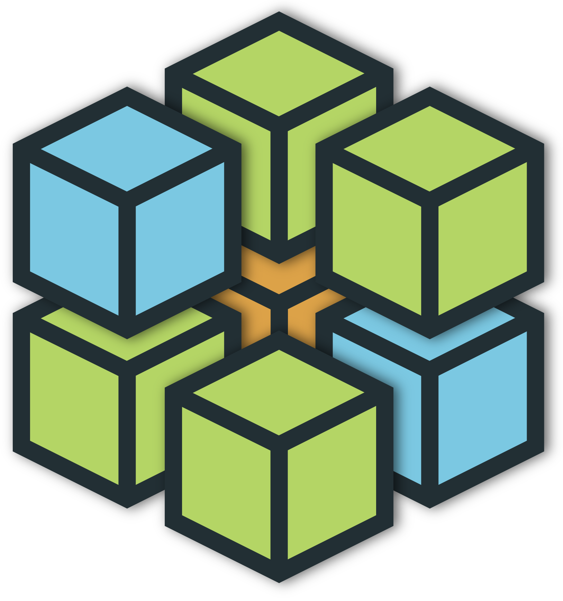
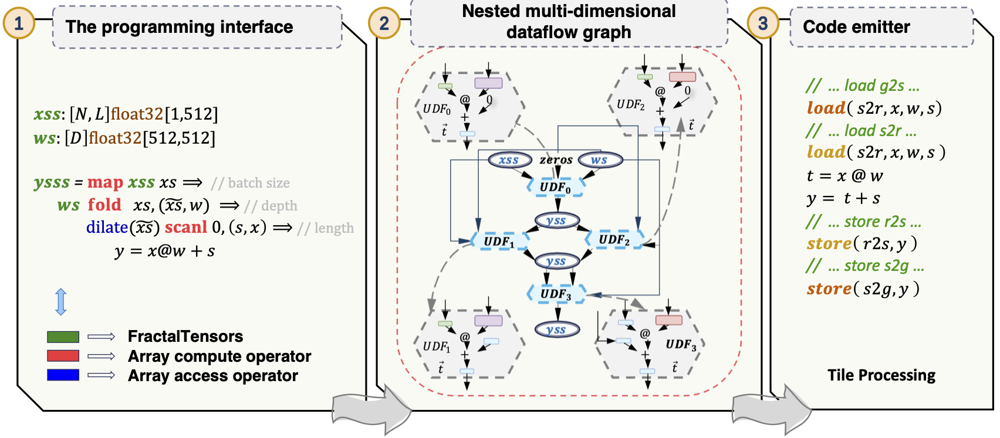

<div align="center">
  
</div>


# Program Neural Network with FractalTensor

FractalTensor is a programming framework that introduces a novel approach to organizing data in deep neural networks (DNNs) as a list of lists of statically-shaped tensors, referred to as a FractalTensor. It supports advanced functional list operations, including array compute operators inherited from second-order array combinators (SOACs) such as map, reduce, and scan, as well as first-order array access operators. These high-level operators can be applied to process the nested structure of FractalTensor variables, explicitly revealing opportunities for exploiting nested data parallelism and access locality through automatic compiler analysis.

<p align="center">
<br>
</p>

As illustrated, the FractalTensor framework consists of three components that can function independently. We have separated these components into individual projects: (1) the front-end programming interface (in this repository), (2) [the intermediate representation (IR)](https://github.com/TiledTensor/TiledLower), and (3) a tile processing library called [TileFusion]( https://github.com/microsoft/TileFusion), which we developed to elevate CUDA C’s level of abstraction for processing tiles.

FractalTensor is not currently under active refactoring and development.

## Usage

### Clone the project

```bash
## Clone project
git clone git@github.com:microsoft/FractalTensor.git
cd FractalTensor
```

### Build from source

```bash
export CUDNN_HOME=...
make build CUDNN_HOME=$CUDNN_HOME
```

## Publication

For more technical details, please refer to our paper:

```bibtex
@inproceedings{
  fractaltensor,
  title={Uncovering Nested Data Parallelism and Data Reuse in DNN Computation with FractalTensor},
  author={Liu Siran and
          Qi Chengxiang and
          Cao Ying and
          Yang Chao and
          Hu Weifang and
          Shi Xuanhua and
          Yang Fan and
          Yang Mao},
  booktitle={Proceedings of the ACM SIGOPS 30th Symposium on Operating Systems Principles},
  pages={160--177},
  year={2024}
}
```

## Contributing

This project welcomes contributions and suggestions.  Most contributions require you to agree to a
Contributor License Agreement (CLA) declaring that you have the right to, and actually do, grant us
the rights to use your contribution. For details, visit https://cla.opensource.microsoft.com.

When you submit a pull request, a CLA bot will automatically determine whether you need to provide
a CLA and decorate the PR appropriately (e.g., status check, comment). Simply follow the instructions
provided by the bot. You will only need to do this once across all repos using our CLA.

This project has adopted the [Microsoft Open Source Code of Conduct](https://opensource.microsoft.com/codeofconduct/).
For more information see the [Code of Conduct FAQ](https://opensource.microsoft.com/codeofconduct/faq/) or
contact [opencode@microsoft.com](mailto:opencode@microsoft.com) with any additional questions or comments.

## Trademarks

This project may contain trademarks or logos for projects, products, or services. Authorized use of Microsoft 
trademarks or logos is subject to and must follow 
[Microsoft's Trademark & Brand Guidelines](https://www.microsoft.com/en-us/legal/intellectualproperty/trademarks/usage/general).
Use of Microsoft trademarks or logos in modified versions of this project must not cause confusion or imply Microsoft sponsorship.
Any use of third-party trademarks or logos are subject to those third-party's policies.
