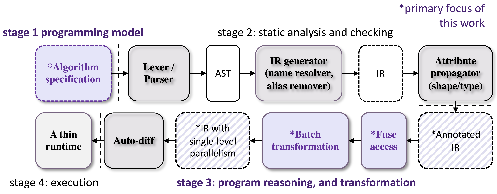

# Program Neural Network with FractalTensor

**Optimize programming neural network applications for both modern parallel computers and modern programmers!**

As deep learning models become more and more complex, it is more and more important to structure them well. Well-structured and modular programs are easy to write and are more tractable for a compiler to reason and generate efficient codes for a variety of parallel computers.

However, an important challenge is how _**one can divide up the original problem into sub-solutions depend directly on how one can glue sub-solutions together**_. FractalTensor embraces functional style programming for an easier auto-parallelization and explores two powerful glue in functional programming: high-order function and lazy evaluation.

In FractalTensor, the assignment is interpreted as variable binding. All primitive operations (functions) have no effect other than to compute its result. This is to make the order of execution irrelevant and relieves the programmer of the burden of prescribing the flow of control.

The goals of FractalTensor are to:
1. provide a set of _data-parallel_ constructs to uncover and exploit _nested_ parallelisms hidden in neural network applications; These constructs could be embedded into a sequential language.
1. provide compile-time analysis techniques to glue the proposed constructs together to generate efficient evaluation codes/plans for a variety of parallel computers.

<p align="center">
<br>
</p>

## Usage
### Clone Project
```bash
## Clone project
git clone git@github.com:lcy-seso/FractalTensor.git
cd FractalTensor
```

### Build from souece
```bash
export CUDNN_HOME=...
make build CUDNN_HOME=$CUDNN_HOME
```

### Test
#### FrontEnd:
```bash
make install-python
make test-frontend
```

#### BackEnd:
```bash
make test-backend
```

## Contributing

This project welcomes contributions and suggestions.  Most contributions require you to agree to a
Contributor License Agreement (CLA) declaring that you have the right to, and actually do, grant us
the rights to use your contribution. For details, visit https://cla.opensource.microsoft.com.

When you submit a pull request, a CLA bot will automatically determine whether you need to provide
a CLA and decorate the PR appropriately (e.g., status check, comment). Simply follow the instructions
provided by the bot. You will only need to do this once across all repos using our CLA.

This project has adopted the [Microsoft Open Source Code of Conduct](https://opensource.microsoft.com/codeofconduct/).
For more information see the [Code of Conduct FAQ](https://opensource.microsoft.com/codeofconduct/faq/) or
contact [opencode@microsoft.com](mailto:opencode@microsoft.com) with any additional questions or comments.

## Trademarks

This project may contain trademarks or logos for projects, products, or services. Authorized use of Microsoft 
trademarks or logos is subject to and must follow 
[Microsoft's Trademark & Brand Guidelines](https://www.microsoft.com/en-us/legal/intellectualproperty/trademarks/usage/general).
Use of Microsoft trademarks or logos in modified versions of this project must not cause confusion or imply Microsoft sponsorship.
Any use of third-party trademarks or logos are subject to those third-party's policies.
